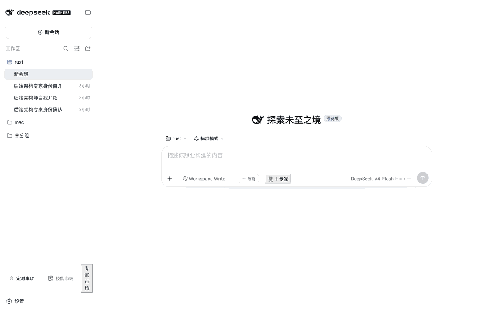
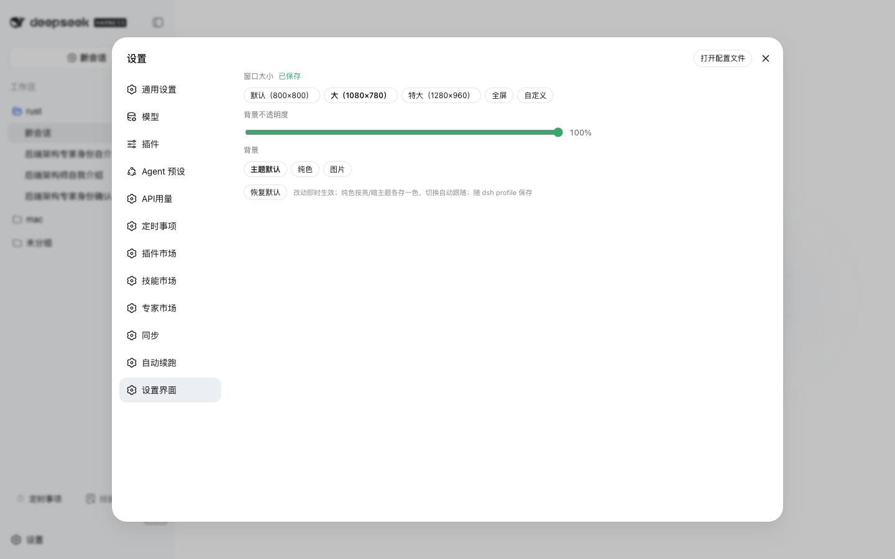
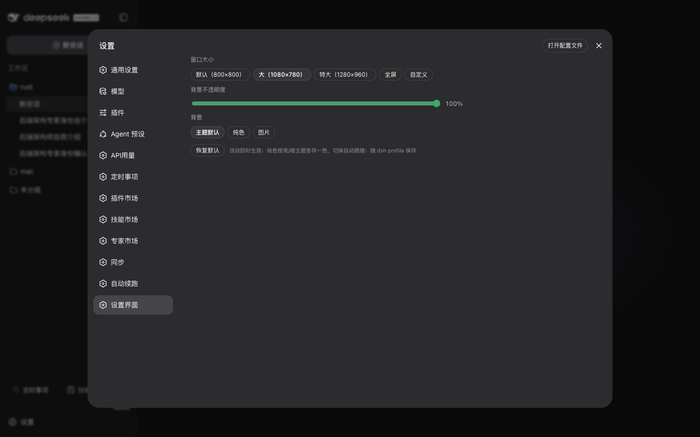
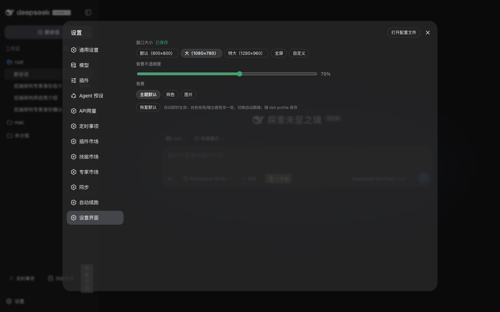
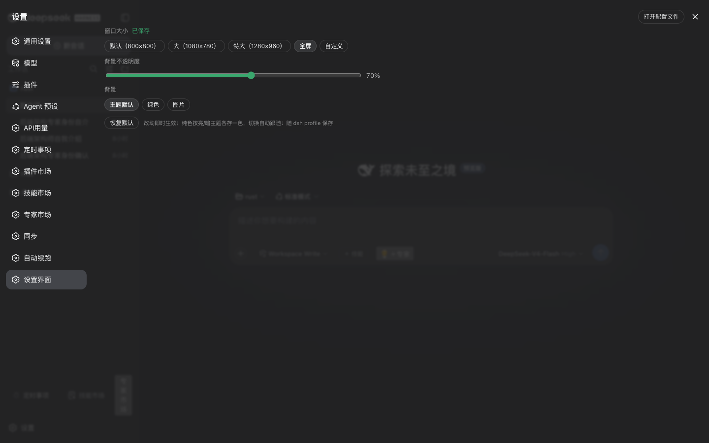

# @weibaohui/dsh-settings-ui

[](https://github.com/topics/dsh-plugin)
[](https://www.npmjs.com/package/@weibaohui/dsh-settings-ui)

**dsh 设置界面自定义**：调整 dsh 原生设置窗口的大小、透明度与背景。设置项就在设置窗口里（左侧导航「设置界面」），改动即时生效。



## 界面预览

**亮色主题**（大尺寸，主题默认背景）：



**暗色主题**——同一设置不刷新页面，切换主题实时跟随：



**暗色 + 不透明度 70%**（半透明毛玻璃）：



**暗色 + 全屏**：



## 核心功能

- **窗口大小**：默认（800×800）/ 大（1080×780）/ 特大（1280×960）/ 全屏 / 自定义宽高（≥480×360，小屏自动收缩）
- **背景不透明度**：30%–100%，半透明毛玻璃效果（跟随明暗主题）
- **背景**：主题默认 / 纯色（**亮、暗主题各存一色**，切换主题实时跟随）
- 改动即时生效，随 dsh profile 保存（换浏览器不丢）；「恢复默认」一键还原

## 安装

```bash
dsh plugin --profile web add @weibaohui/dsh-settings-ui -w
```

装完重启 `dsh web` 即生效。

## 使用

打开 Web UI → 设置 → 左侧导航「设置界面」→ 选尺寸、拖不透明度、选背景。关掉重开设置窗口即可看到效果；全屏模式适合小屏或需要同时看对话的场景。

## 说明

- 尺寸/透明度/背景只作用于原生设置窗口本身，不影响其他界面
- 适配的宿主面板类名来自 `dsh-client-ui-settings-general`（dsh 0.1.1-rc.2 至 0.1.7-rc.2 实测一致）；dsh 大版本升级若面板类名变化，调整会静默失效（无害，恢复默认样式），届时更新本插件即可
- 设置随 dsh profile 持久化（0.1.7 起经 settings 文档写入 profile patch）。从 dsh ≤0.1.6 升级后首次运行会自动把 `settings.yaml.imported` 里残留的 `settings-ui` 节迁移回来（仅当本 profile 从未手动设置过时执行一次）

## 联系我 :飞书群


## 版本兼容性

本插件与 [DeepSeek Harness](https://github.com/deepseek-ai/deepseek-harness)（`@deepseek-ai/dsh`）的版本对应关系：

| 插件版本 | 适配 dsh 版本 | 备注 |
|---------|--------------|------|
| 0.2.5 | 0.1.7-rc.2 | 当前版本；适配 0.1.7 settings 模型（导出 volatile `Config`，`ctx.settings.update` 持久化），自动迁移 settings.yaml.imported 残留设置 |
| 0.2.3 / 0.2.4 | 0.1.7-rc.2 | settings 改动只在本次运行内生效（0.1.7 移除了 `ctx.settings.register`），重启还原 |

> **发版约定**：每次发布新版本时，请在上表追加一行，记录该插件版本实际验证所用的 `@deepseek-ai/dsh` 版本。`package.json` 的 `engines.dsh` 声明最低支持版本；本表记录实际验证版本，二者配合使用。
